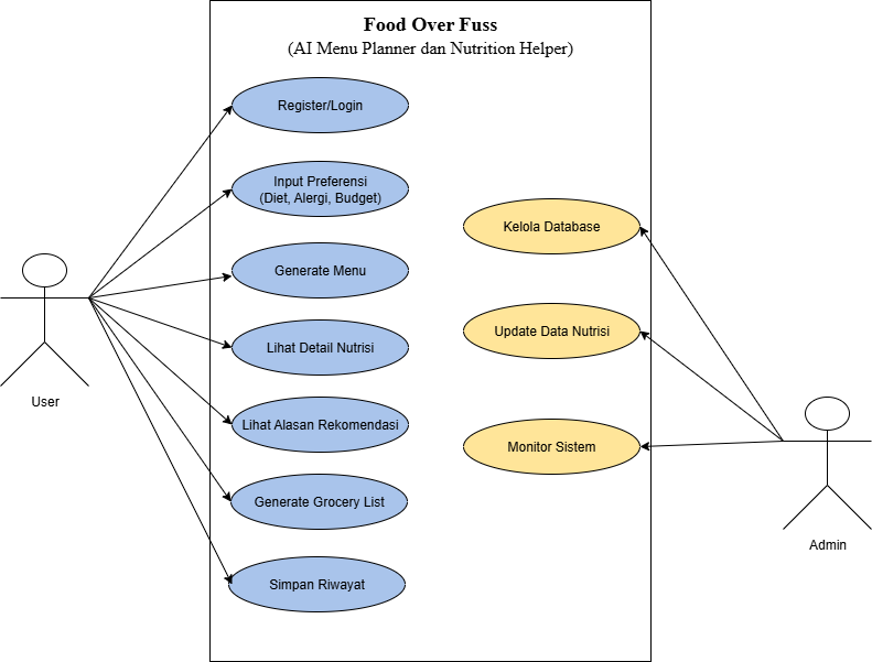
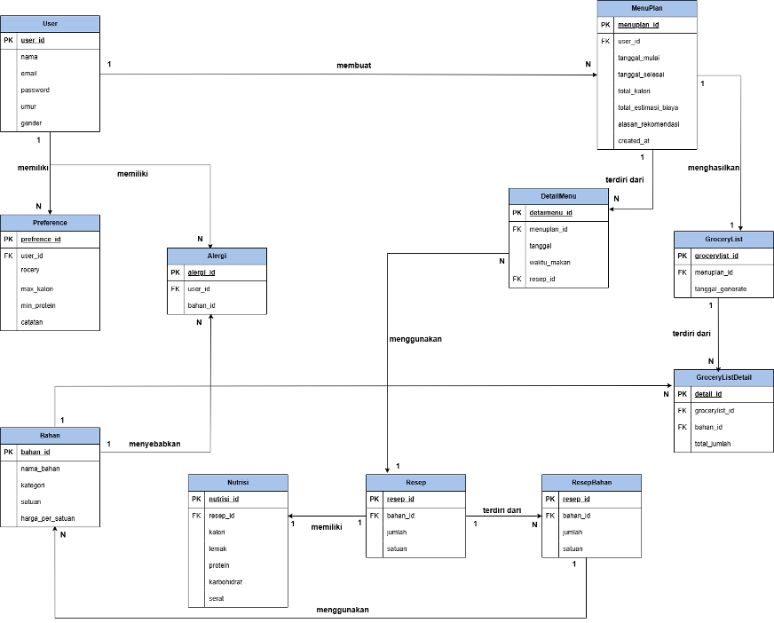
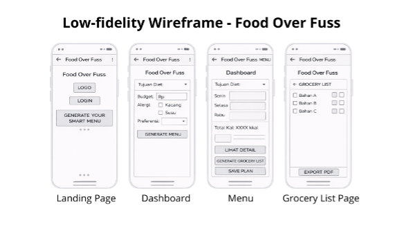

# Project Senior Project TI
**Instansi:** Departemen Teknik Elektro dan Teknologi Informasi, Fakultas Teknik, Universitas Gadjah Mada

## Kelompok: Nonstop notif
**Anggota Tim:**
* Flavia Hidayriamraata Pualam (22/494376/TK/54219)
* Agatha Husna Amalia (23/515562/TK/56686)
* Bernards Widiyazulfathirrochim (23/512647/TK/56341)

---

## Detail Proyek

### 1. Identitas Produk
* **Nama Produk:** Food Over Fuss
* **Jenis Produk:** Aplikasi web berbasis kecerdasan buatan (AI Menu Planner and Nutrition Helper).

### 2. Latar Belakang & Permasalahan

#### Latar Belakang:
Pola makan yang sehat dan terencana merupakan faktor penting dalam menjaga kesehatan dan produktivitas individu. Namun, banyak masyarakat mengalami kesulitan
dalam menyusun menu makanan harian atau mingguan yang sesuai dengan kebutuhan nutrisi, preferensi makanan, keterbatasan anggaran, serta kondisi khusus seperti alergi
atau diet tertentu. Proses perencanaan menu secara manual sering kali memakan waktu, kurang konsisten, dan tidak mempertimbangkan keseimbangan nutrisi secara menyeluruh. Seiring berkembangnya teknologi kecerdasan buatan, AI dapat
dimanfaatkan untuk membantu pengguna dalam mengambil keputusan yang lebih tepat dan personal terkait perencanaan menu makanan.

#### Rumusan Permasalahan:
Permasalahan utama yang dapat diidentifikasi adalah bagaimana menyediakan sistem yang mampu membantu pengguna menyusun rencana menu makanan secara mudah, cepat, dan sesuai dengan kebutuhan individu. Selain itu, pengguna sering kali kesulitan menentukan menu yang seimbang secara nutrisi, menghindari bahan makanan tertentu, serta memastikan variasi menu agar tidak monoton. Oleh karena itu, dibutuhkan sebuah sistem yang dapat memberikan rekomendasi menu yang relevan, personal, dan mudah
dipahami tanpa memerlukan pengetahuan khusus di bidang gizi.

### 3. Ide Solusi & Rancangan Fitur
Sebagai solusi atas permasalahan tersebut, dikembangkan sebuah aplikasi web berbasis kecerdasan buatan yang berfungsi sebagai AI Menu Planner dan Nutrition Helper.
Aplikasi ini memungkinkan pengguna untuk memasukkan preferensi makanan, tujuan konsumsi (seperti diet sehat, penghematan biaya, atau keseimbangan nutrisi), serta
batasan tertentu seperti alergi atau pantangan makanan. Berdasarkan input tersebut, sistem akan menghasilkan rencana menu harian atau mingguan yang disesuaikan secara
personal. AI digunakan untuk melakukan penalaran dan penyusunan menu, sementara logika berbasis aturan diterapkan untuk memastikan menu memenuhi batasan nutrisi
dan preferensi pengguna. Selain itu, aplikasi juga menyediakan fitur estimasi kalori, ringkasan nutrisi, serta daftar belanja otomatis untuk mendukung kemudahan
implementasi menu dalam kehidupan sehari-hari.

**Rancangan Fitur Solusi:**
| Fitur | Keterangan |
| :--- | :--- |
| Input Preferensi Pengguna | Fitur yang memungkinkan pengguna memasukkan preferensi makanan, tujuan konsumsi (sehat, diet, hemat), serta batasan seperti alergi atau pantangan tertentu. |
| Generator Menu Otomatis | Sistem berbasis AI yang menyusun rencana menu harian atau mingguan secara otomatis berdasarkan data dan preferensi pengguna. |
| Estimasi Kalori & Nutrisi | Menyediakan perkiraan jumlah kalori dan informasi nutrisi dasar untuk setiap menu yang direkomendasikan. |
| Filter Alergi & Pantangan | Fitur untuk memastikan menu yang dihasilkan tidak mengandung bahan makanan yang dilarang atau berisiko bagi pengguna. |
| Daftar Belanja Otomatis | Menghasilkan daftar bahan makanan yang dibutuhkan berdasarkan menu yang dipilih, sehingga memudahkan proses belanja. |
| Penjelasan Rekomendasi Menu | AI memberikan alasan singkat mengapa menu tertentu direkomendasikan sesuai dengan tujuan dan preferensi pengguna. |
| Variasi Menu | Menjaga keberagaman menu agar pengguna tidak mendapatkan menu yang sama secara berulang dalam periode perencanaan. |
| Riwayat Perencanaan Menu | Menyimpan rencana menu sebelumnya agar pengguna dapat melihat, membandingkan, atau menggunakan kembali menu yang pernah dibuat. |

### 4. Analisis Kompetitor

#### Kompetitor 1
| Atribut | Keterangan |
| :--- | :--- |
| **Nama** | Mealime |
| **Jenis Kompetitor** | Direct Competitors |
| **Jenis Produk** | Meal planning dan recipe recommendation |
| **Target Customer** | Individu dan keluarga yang ingin menyusun menu makan sehat secara praktis |
| **Kelebihan** | <ul><li>Antarmuka pengguna sederhana dan mudah digunakan</li><li>Menyediakan menu yang dapat disesuaikan dengan preferensi dan alergi</li><li>Otomatis menghasilkan *grocery list* yang terstruktur</li></ul> |
| **Kekurangan** | <ul><li>Fleksibilitas personalisasi nutrisi masih terbatas</li><li>Fitur AI generatif belum mendalam (lebih bersifat rule-based)</li></ul> |
| **Key Competitive Advantage & Unique Value** | Kemudahan penggunaan dan pengalaman pengguna yang intuitif, sehingga cocok untuk pengguna awam yang ingin perencanaan menu cepat tanpa konfigurasi kompleks. |

#### Kompetitor 2
| Atribut | Keterangan |
| :--- | :--- |
| **Nama** | PlanEat |
| **Jenis Kompetitor** | Direct Competitors |
| **Jenis Produk** | AI-powered meal planner |
| **Target Customer** | Pengguna individu yang ingin menu makan terpersonalisasi berbasis AI |
| **Kelebihan** | <ul><li>Menggunakan AI untuk menyusun menu secara otomatis</li><li>Mendukung berbagai jenis diet dan preferensi makanan</li><li>Menyediakan daftar belanja otomatis</li></ul> |
| **Kekurangan** | <ul><li>Pilihan resep masih relatif terbatas</li><li>Informasi nutrisi belum terlalu detail</li></ul> |
| **Key Competitive Advantage & Unique Value** | Pemanfaatan AI untuk personalisasi menu, sehingga pengguna mendapatkan rekomendasi yang lebih relevan dibandingkan meal planner konvensional. |

#### Kompetitor 3
| Atribut | Keterangan |
| :--- | :--- |
| **Nama** | Mealmind |
| **Jenis Kompetitor** | Direct Competitors |
| **Jenis Produk** | Aplikasi AI-powered meal planner dan menyediakan daftar belanja interaktif dan resep yang sesuai dengan kondisi pengguna. |
| **Target Customer** | Individu yang ingin menyusun rencana makan secara otomatis dan personal. |
| **Kelebihan** | <ul><li>AI Meal Plan Personalization</li><li>Interactive Shopping List</li><li>Recipe Guidance</li></ul> |
| **Kekurangan** | <ul><li>Biaya Penggunaan</li><li>Ketergantungan pada Input Manual</li><li>Batasan Customisasi Lanjutan</li></ul> |
| **Key Competitive Advantage & Unique Value** | Meal planner berbasis AI yang lengkap dan praktis serta menyusun menu otomatis, memberikan shopping list interaktif, dan resep langkah demi langkah |

## Metologi SDLC
**Metodologi yang digunakan:** Agile

**Alasan pemilihan metodologi:**
Model Agile memisahkan pengembangan produk ke dalam beberapa siklus (sprint) agar dapat dengan segera memberikan produk fungsional pada setiap akhir iterasi. Karena Food Over Fuss memanfaatkan teknologi AI yang membutuhkan banyak eksperimen dan penyesuaian (seperti prompt engineering), model Agile sangat cocok karena mudah mengakomodasi perubahan requirement di tengah proses pengembangan.

### 1. Tujuan dari produk
1. Membantu pengguna menyusun menu harian maupun mingguan secara sistematis, sehingga proses perencanaan makanan menjadi lebih terorganisir dan tidak dilakukan secara spontan.
2. Menghasilkan rekomendasi menu yang sesuai dengan kebutuhan individu, termasuk tujuan diet, preferensi rasa, kondisi alergi atau pantangan makanan, serta batasan anggaran.
3. Memberikan estimasi kalori dan informasi nutrisi dasar untuk setiap menu yang direkomendasikan, sehingga pengguna dapat menjaga keseimbangan asupan gizi.
4. Menyediakan daftar belanja otomatis (auto grocery list) berdasarkan menu yang dipilih, guna mempermudah implementasi rencana menu dalam kehidupan sehari-hari.
5. Mengurangi kebingungan pengguna dalam menentukan pilihan makanan, khususnya dalam hal:
   * Menentukan menu yang sesuai dengan tujuan diet
   * Menyusun kombinasi makanan yang seimbang secara nutrisi
   * Menghindari bahan makanan tertentu
   * Menjaga variasi menu agar tidak monoton

### 2. Pengguna potensial & kebutuhannya
1. **Mahasiswa / Individu dengan Anggaran Terbatas**
   
   *Kebutuhan:* Rekomendasi menu yang bahan bakunya murah, mudah didapat, dan cepat dimasak.
2. **Pekerja Sibuk yang Ingin Hidup Sehat**
   
   *Kebutuhan:* Otomatisasi penyusunan menu harian dan pembuatan grocery list (daftar belanja) terpadu untuk menghemat waktu.
3. **Individu yang Menjalani Program Diet / Memiliki Alergi**
   
   *Kebutuhan:* Filter bahan makanan yang ketat dan informasi estimasi kalori serta nutrisi yang jelas.

### 3. Use case diagram

### 4. Functional requirements 

| FR | Deskripsi |
| :--- | :--- |
| **FR 1** | Sistem harus menyediakan formulir input bagi pengguna untuk memasukkan preferensi makanan, batasan anggaran, dan alergi. |
| **FR 2** | Sistem harus dapat memproses input pengguna menggunakan AI untuk menghasilkan rencana menu harian atau mingguan. |
| **FR 3** | Sistem harus mampu menampilkan estimasi jumlah kalori dan informasi nutrisi pada setiap menu yang dihasilkan. |
| **FR 4** | Sistem harus secara otomatis mengekstrak bahan masakan dari menu yang dipilih menjadi sebuah Daftar Belanja (Grocery List). |
| **FR 5** | Sistem harus memiliki database untuk menyimpan dan menampilkan riwayat rencana menu yang pernah dibuat pengguna. |

### 5. Entity relationship diagram

### 6. Low-fidelity Wireframe

### 7. Gantt-Chart pengerjaan proyek

| Kegiatan | 1 | 2 | 3 | 4 | 5 | 6 | 7 | 8 | 9 | 10 | 11 | 12 |
| :--- | :---: | :---: | :---: | :---: | :---: | :---: | :---: | :---: | :---: | :---: | :---: | :---: |
| Requirement Finalisasi | X | X | | | | | | | | | | |
| Desain UI/UX | | | X | X | | | | | | | | |
| Database design | | | | | X | | | | | | | |
| Backend Setup | | | | | X | X | | | | | | |
| Development | | | | | | X | X | X | X | | | |
| Testing internal | | | | | | | | | | X | | |
| Perbaikan bug | | | | | | | | | | | X | |
| Deployment (cloud) | | | | | | | | | | | | X |
| User testing | | | | | | | | | | | | X |
| Finalisasi dokumentasi | | | | | | | | | | | | X |